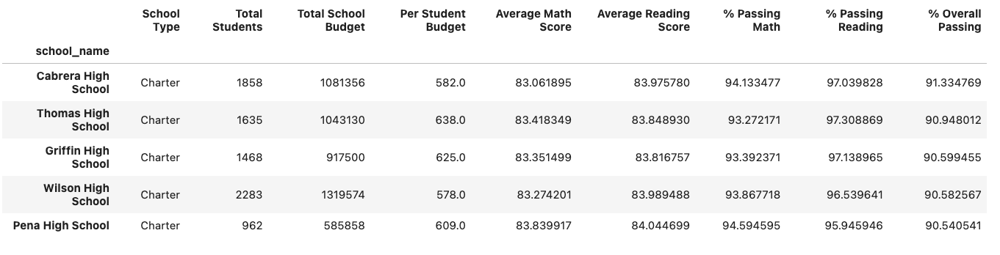
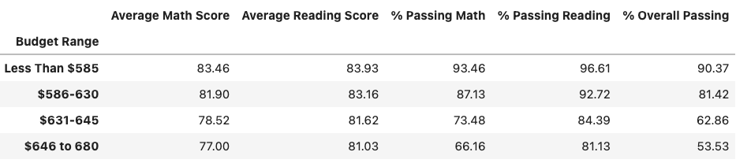
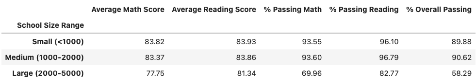

# School-District-Trends

Pandas and Jupyter Notebook were used to analyze school district data to find trends relating to standardized test results.

The following 3 observations can be made based on the data analysis:

1. The top five schools with the highest percentage of students passing both reading and math tests were all Charter schools. The bottom 5 schools were all public schools. Additionally, charter schools had a higher percentage of students passing reading and math, compared to public schools.

2. The lowest budget per student ($585 or less) had the highest percentage of students passing both reading and math, at %90.37. Additionally, The highest budget per student ($645-$680) had the lowest percentage of students passing both reading and math, at 53.53%

3. Smaller schools (1,000 students or less) had a higher percentage of overall passing students (89.88%), and schools in the larger student range (2,000-5,000) had a lower percentage of overall passing students (58.29%).

